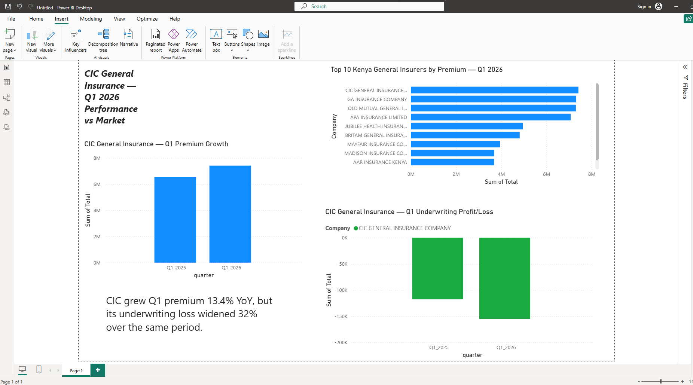

# CIC General Insurance — Q1 2025 vs Q1 2026 Performance Analysis

A self-directed data analytics project analyzing Kenya's general insurance market using official regulatory data, with a focus on CIC General Insurance Company's premium growth and underwriting performance.

## Question

How has CIC General Insurance's premium growth and underwriting profitability changed year-on-year, and how does that compare to the broader Kenyan general insurance market?

## Data Source

- **Insurance Regulatory Authority (IRA) of Kenya** — Quarterly Industry Statistics (Q1 2025 and Q1 2026)
- Publicly available at [ira.go.ke/quarterly-reports](https://www.ira.go.ke/quarterly-reports/)
- Raw files included in [`data/raw/`](data/raw/)

## Method

1. Extracted and cleaned raw regulatory Excel files using **Python (pandas)** — see [`scripts/analysis.py`](scripts/analysis.py)
2. Handled inconsistent sheet naming across releases (e.g. `UWProfit` in one release vs `APPENDIX 20` in another)
3. Removed subtotal rows and separated primary insurers from reinsurers, which have very different market structures
4. Identified that one IRA release (labelled "Quarter-4 2025") is actually **cumulative year-to-date data**, not a standalone quarter — this was excluded from the quarter-over-quarter trend to avoid a misleading comparison (see [Limitations](#limitations))
5. Combined cleaned data into **Power BI** to build an interactive dashboard covering market share, premium growth, and underwriting performance

## Key Findings

1. **CIC General Insurance grew Q1 gross direct premium by 13.35% year-on-year** (KES 6.54M → 7.41M), placing it among the top-performing insurers in a fragmented market where the top four primary insurers each hold 8.7–9.2% market share.
2. **Despite this growth, CIC's underwriting loss widened by roughly 32%** over the same period (KES −117,768 → −155,099), indicating premium growth did not translate into improved underwriting profitability.
3. **This pattern is company-specific, not industry-wide** — several competitors (e.g. NCBA Insurance, Continental Reinsurance) improved their underwriting results over the same period, while others (Jubilee Health, Mayfair) deteriorated more sharply than CIC.
4. CIC ranks **#1 by premium** among primary insurers in Q1 2026.

## Dashboard



Three views:
1. Top 10 Kenyan general insurers by premium, Q1 2026
2. CIC's Q1 premium growth, 2025 vs 2026
3. CIC's Q1 underwriting profit/loss, 2025 vs 2026

## Repository Structure

```
├── data/
│   ├── raw/            # Original IRA Excel releases
│   └── processed/      # Cleaned CSVs used in Power BI
├── scripts/
│   └── analysis.py     # Full data cleaning and analysis pipeline
├── images/
│   └── dashboard_screenshot.png
└── README.md
```

## Limitations

- This is a two-quarter comparison (Q1 2025 vs Q1 2026); a longer time series would strengthen confidence in the trend.
- IRA's quarterly releases show inconsistent sheet naming between periods, and at least one release presented cumulative (year-to-date) figures without a clearly comparable single-quarter label — this was identified during cleaning and excluded from the trend analysis.
- Figures are drawn from regulatory filings and have not been independently audited beyond the cleaning and cross-checks described above.

## Tools Used

Python (pandas), Power BI Desktop

---
*Prepared by Eric Maina*
